# Administración y Monitoreo de Base de Datos en SQL Server

## Introducción

El presente proyecto fue desarrollado como parte de un proceso de análisis, administración y optimización de una base de datos empresarial en SQL Server.

Se recibió el requerimiento de evaluar el estado actual de una base de datos orientada a la gestión de ventas, productos, clientes y sucursales, con el objetivo de identificar problemas de rendimiento, limitaciones estructurales y posibles riesgos administrativos que pudieran afectar la escalabilidad del sistema.

A partir de este requerimiento, se realizaron tareas relacionadas con:

- Instalación y configuración del entorno SQL Server
- Análisis estructural de la base de datos proporcionada
- Monitoreo de rendimiento mediante métricas de SQL Server
- Implementación de índices y optimizaciones
- Estrategias de respaldo y restauración
- Mejoras estructurales del modelo relacional
- Configuración de seguridad y control de accesos
- Monitoreo administrativo y análisis de consumo de recursos

El proyecto fue desarrollado siguiendo buenas prácticas de administración de bases de datos, priorizando aspectos como integridad de la información, rendimiento, escalabilidad y seguridad.


## Objetivo general

Administrar, analizar y optimizar una base de datos en SQL Server mediante técnicas de monitoreo, respaldo, seguridad e implementación de mejoras estructurales que permitan incrementar el rendimiento, la integridad y la escalabilidad del sistema.

## Objetivos específicos
- Instalar y configurar correctamente SQL Server y SQL Server Management Studio.
- Analizar la estructura de la base de datos proporcionada.
- Detectar cuellos de botella mediante monitoreo de consultas.
- Implementar índices para mejorar el rendimiento.
- Aplicar estrategias de respaldo y restauración.
- Mejorar la estructura relacional para soportar escenarios multi-sucursal.
- Configurar mecanismos básicos de seguridad y control de accesos.
- Realizar monitoreo administrativo del consumo de recursos del sistema.


## 1. Instalación

Dirigirse a la página oficial de Microsft y descargar SQL Server, para este proyecto utilizaré SQL Server 2025 Express

```
https://www.microsoft.com/es-es/sql-server/sql-server-downloads
```
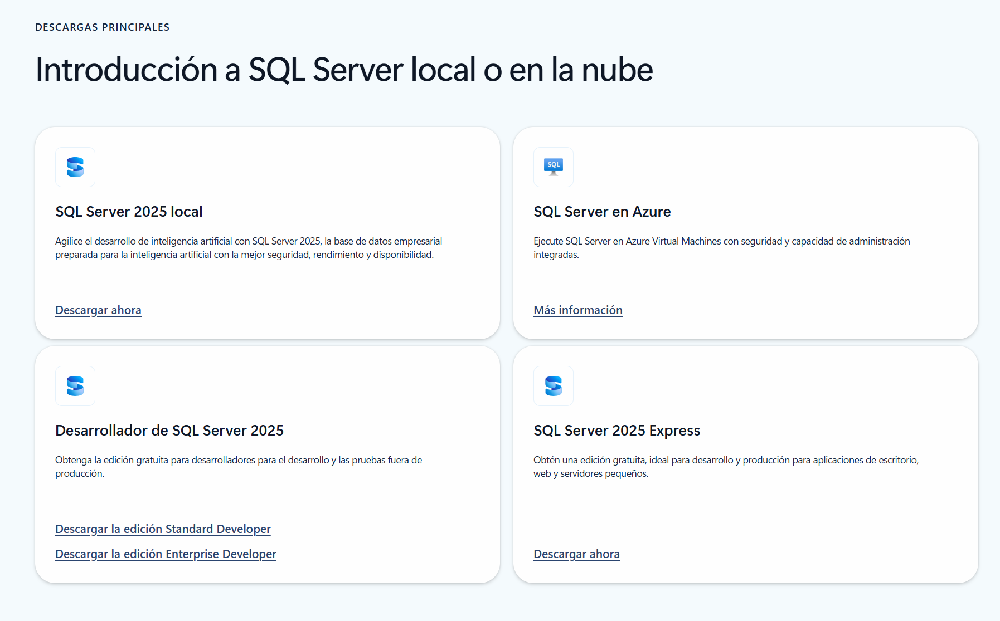

Ejecutar como administrador para darle los permisos necesarios durante la instalación

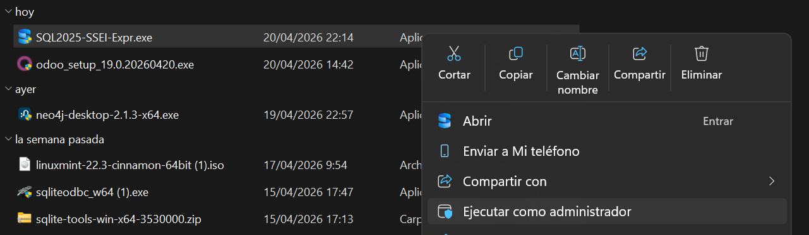

Escoger el tipo de instalación básico para comenzar con las configuraciones por defecto. Normalmente viene configurado para ingresar credenciales y trabajar rápidamente.

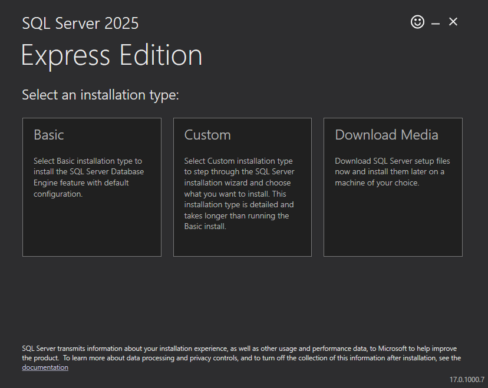

Escoger idioma de preferencia y aceptar los términos.

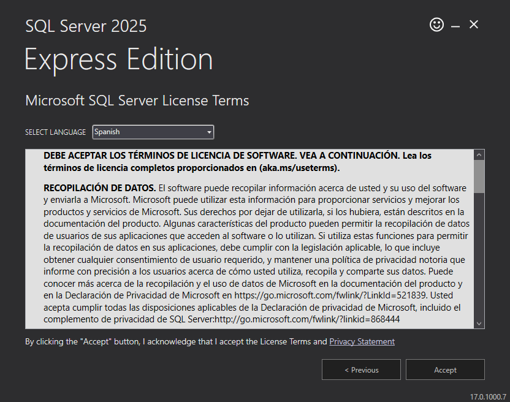

Escoger el directorio en dónde deseas guardar tus bases de datos.

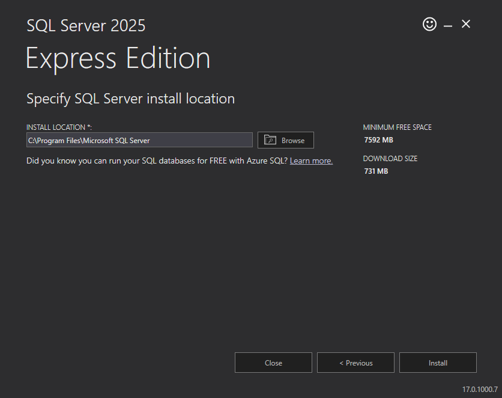

Posteriormente instalar. 

Si la instalación se completa con éxito, deberá mostrarte esto:

- INSTANCE NAME:  SQLEXPRESS → Es el nombre de la instancia. Como puedes tener múltiples SQL Server en una misma PC, esto identifica cuál es.

- CONNECTION STRING: Server=localhost\SQLEXPRESS;Database=master;Trusted_Connection=True → Es la dirección que usarás para conectarte desde aplicaciones o herramientas. Usa autenticación de Windows (tu usuario).

- SQL ADMINISTRATORS: DESKTOP-91F9CRE\Diego Debroy → Usuario que es administrador de este SQL Server.

- LOG FOLDER: Carpeta donde se guardan los registros (logs) de instalación y configuración.

- FEATURES INSTALLED: SQLENGINE → Solo instalaste el motor de base de datos, sin Reporting Services, Integration Services, etc.

- VERSION: 	17.0.1000.7, RTM → Versión inicial (RTM = Release To Manufacturing).

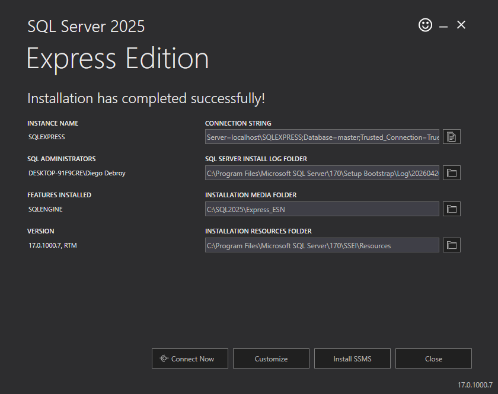


### Descargar SSMS

```
https://learn.microsoft.com/en-us/ssms/install/install?redirectedfrom=MSDN
```

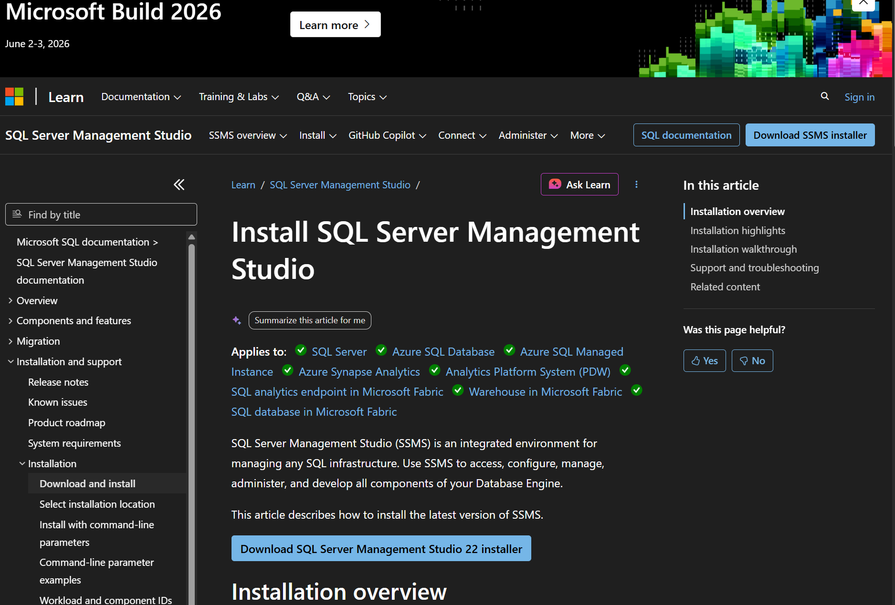

Una vez descargado, ejecutar para comenzar con la instalación

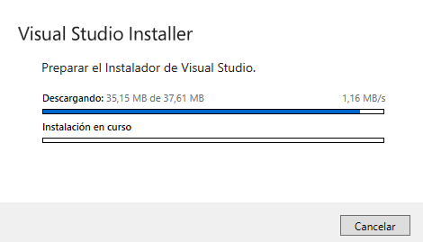

Da la opción de añadir componentes de ayuda durante la descarga, para este ejemplo descargaré 'Control de Versiones Git' y 'Proyectos de SQL Database' ya que es muy útil para organizar el trabajo. Estos componentes se pueden instalar en cualquier momento. 

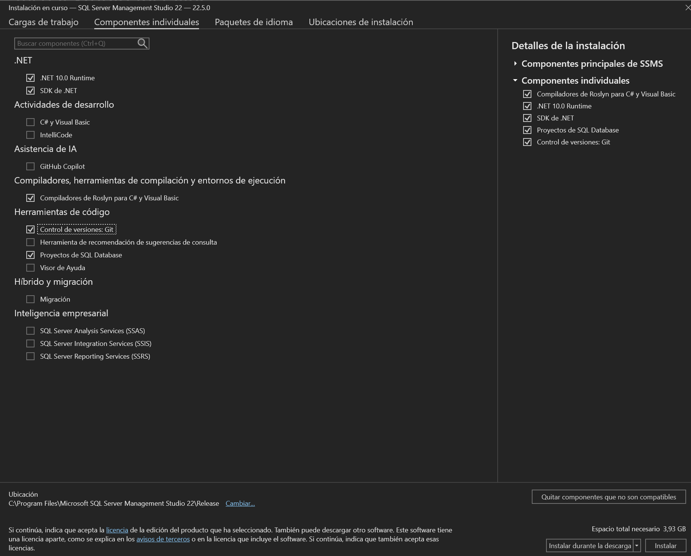

Esperar mientras se completa la descarga, el tiempo varía conforme las capacidades del equipo.

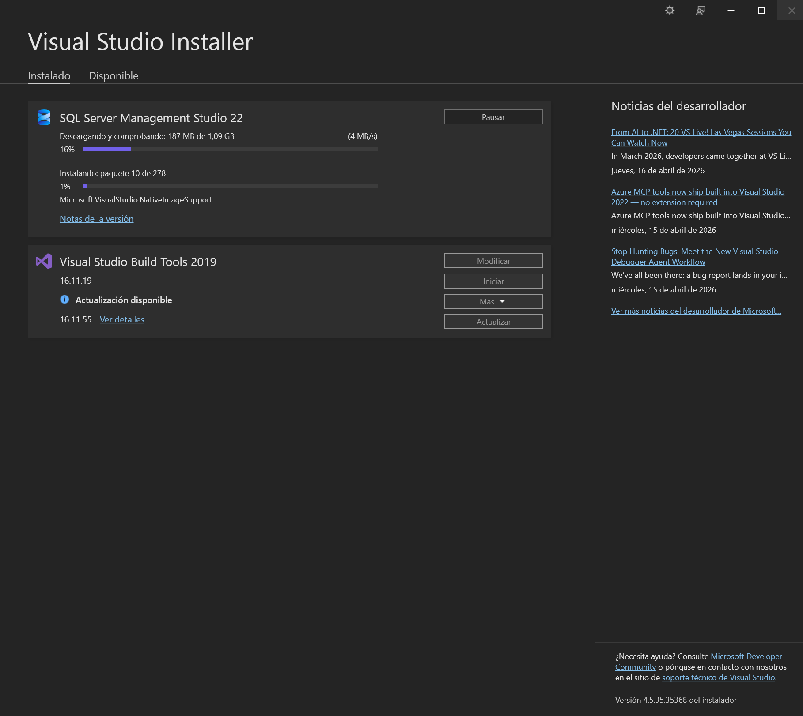

Luego de que la instalación finalizó, se debe reiniciar el equipo. 

Iniciar sesión (opcional)

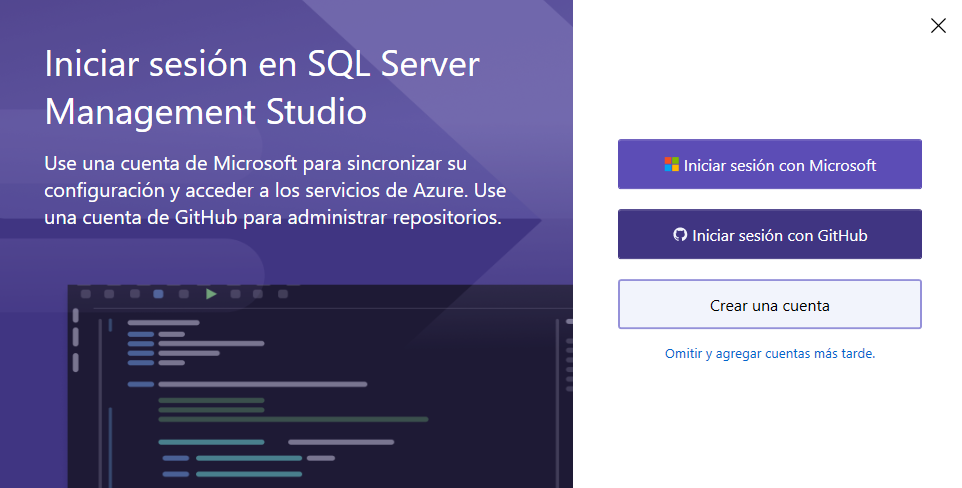


## 2. Configurar SSMS 

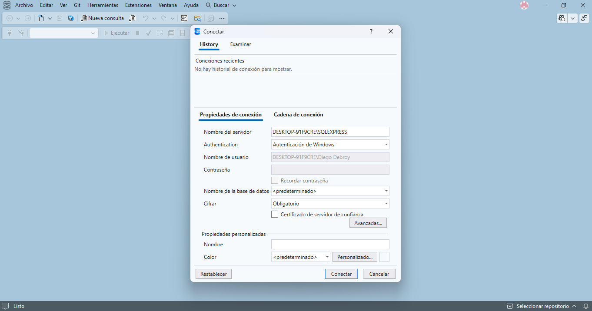

1. Al abrir SSMS, se mostrará el cuadro de diálogo "Conectar al servidor".

2. Verifique que los datos sean los siguientes:

- Tipo de servidor: Motor de base de datos
- Nombre del servidor: DESKTOP-91F9CRE\SQLEXPRESS (o localhost\SQLEXPRESS)
- Autenticación: Autenticación de Windows

3. No modifique el resto de los campos.

4. Haga clic en Conectar.

Nota: No se requiere contraseña al usar autenticación de Windows, ya que SSMS utiliza las credenciales de la sesión activa del sistema operativo.

### Solución de error de certificado SSL
Error: Al intentar conectar aparece el error "La cadena de certificación fue emitida por una entidad en la que no se confía".

Causa: SQL Server utiliza un certificado autofirmado y el cliente no confía en él.

Solución:

En la ventana Conectar al servidor, haga clic en Avanzadas.

Establezca la propiedad Trust Server Certificate en True.

Haga clic en Aceptar y luego en Conectar.

Nota de seguridad: Esta opción es aceptable para entornos de desarrollo y pruebas. En producción, use un certificado válido de una autoridad certificadora (CA) de confianza.


SQL Server está listo para gestionar bases de datos. 
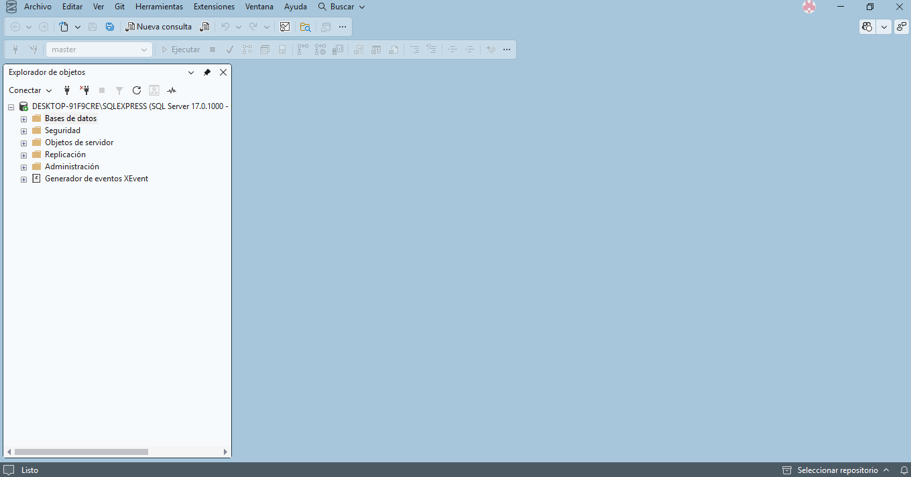

## 3. Análisis de base de datos proporcionada 

Como parte del requerimiento inicial, se proporcionó una base de datos denominada nexoshop, diseñada para gestionar operaciones comerciales relacionadas con clientes, productos, ventas y sucursales.

El objetivo principal de esta etapa consistió en evaluar la estructura actual del sistema para identificar posibles problemas de diseño, rendimiento y administración que pudieran afectar el crecimiento futuro de la aplicación.

A continuación, se presenta la estructura original de la base de datos entregada.


```
CREATE DATABASE nexoshop;
GO

USE nexoshop;
GO

CREATE TABLE cliente(
	id_cliente INT PRIMARY KEY,
	nombre VARCHAR(50) NOT NULL,
	apellido VARCHAR(50) NOT NULL,
	correo VARCHAR(50),
	cui VARCHAR(50),
	nit VARCHAR(50),
	created_at DATETIME2,
	updated_at DATETIME2
);

SELECT * FROM cliente;

CREATE TABLE sucursal(
	id_sucursal INT PRIMARY KEY,
	nombre VARCHAR(75) NOT NULL,
	direccion VARCHAR(250),
	estado VARCHAR(10) CHECK(estado IN ('ACTIVO', 'INACTIVO')),
	created_at DATETIME2,
	updated_at DATETIME2
);

CREATE TABLE usuario (
	id_usuario INT PRIMARY KEY,
	id_sucursal INT NOT NULL,
	nombre VARCHAR(50) NOT NULL,
	apellido VARCHAR(50) NOT NULL,
	correo VARCHAR(50) NOT NULL,
	cui VARCHAR(50) NOT NULL,
	nit VARCHAR(50) NOT NULL,
	created_at DATETIME2,
	updated_at DATETIME2,
	FOREIGN KEY (id_sucursal) REFERENCES sucursal(id_sucursal)
);


CREATE TABLE producto(
	id_producto INT PRIMARY KEY,
	id_sucursal INT NOT NULL,
	nombre VARCHAR(50) NOT NULL,
	descripcion VARCHAR(250),
	categoria VARCHAR(75),
	fecha_caducida DATETIME2,
	created_at DATETIME2,
	updated_at DATETIME2,
	FOREIGN KEY (id_sucursal) REFERENCES sucursal(id_sucursal)
);

CREATE TABLE venta(
	id_venta INT PRIMARY KEY,
	id_usuario INT NOT NULL,
	id_sucursal INT,
	created_at DATETIME2,
	updated_at DATETIME2,
	FOREIGN KEY (id_usuario) REFERENCES usuario(id_usuario),
	FOREIGN KEY (id_sucursal) REFERENCES sucursal(id_sucursal)
);

CREATE TABLE detalle_venta(
	id_detalle INT PRIMARY KEY,
	id_venta INT NOT NULL,
	id_producto INT NOT NULL,
	cantidad INT NOT NULL,
	precio DECIMAL(10,2),
	created_at DATETIME2,
	updated_at DATETIME2,
	FOREIGN KEY (id_venta) REFERENCES venta(id_venta),
	FOREIGN KEY (id_producto) REFERENCES producto(id_producto)
);

```

La base de datos proporcionada presenta una estructura funcional orientada a la gestión de ventas, clientes, productos y sucursales. Sin embargo, tras su análisis se identificaron varias oportunidades de mejora en términos de diseño, integridad y rendimiento.

### 3.1 Análisis estructural

Se identificó que el modelo relacional permite gestionar correctamente:

Clientes
Usuarios (empleados)
Sucursales
Productos
Ventas y su detalle

Las relaciones entre tablas están definidas mediante claves foráneas, lo cual asegura una base consistente a nivel estructural.

### 3.2 Problemas detectados
A pesar de ser funcional, se encontraron las siguientes limitaciones:

1. Relación usuario - sucursal limitada
La tabla usuario contiene una relación directa con sucursal, lo que implica que:
- Un usuario solo puede pertenecer a una sucursal
- No es posible asignar múltiples sucursales a un mismo usuario
- No se pueden manejar distintos roles por sucursal

2. Falta de índices en consultas críticas 
No se identificaron índices adicionales en columnas utilizadas frecuentemente consultadas:
- venta.created_at
- detalle_venta.id_producto
- venta.id_sucursal

Esto puede generar bajo rendimiento en consultas con grandes volúmenes de datos.

3. Campos sin restricciones adicionales 
Se detectó ausencia de restricciones importantes como:
- UNIQUE en correos electrónicos
- NOT NULL en algunos campos clave
- Validaciones de integridad adicionales
Esto puede provocar inconsistencia en los datos.

4. Modelo de categorías no normalizado
El campo categoria en la tabla producto es un valor de texto libre, lo que puede generar inconsistencias como:
- Valores duplicados
- Diferencias en formato (mayúsculas/minúsculas)
Se recomienda una tabla independiente para categorías.

5. Falta de automatización y monitoreo
La base de datos no cuenta con:
- Mecanismos de respaldo automáticos
- Monitoreo de rendimiento
- Tareas programadas
Esto representa un riesgo en entornos productivos

### 3.3 Conclusión del análisis
La base de datos es funcional para operaciones básicas; sin embargo, requiere mejoras en:
- Escalabilidad
- Rendimiento
- integridad de datos
- Administración
Estas mejoras serán abordadas en las siguientes secciones mediante la implementación de optimizaciones, automatización y buenas prácticas de administración en SQL Server. 

## 4. Monitoreo inicial de rendimiento

Una vez analizada la estructura de la base de datos, se procedió a realizar pruebas de rendimiento sobre consultas representativas del sistema.

El propósito de esta fase fue identificar consultas críticas, detectar posibles cuellos de botella y evaluar el comportamiento del motor de base de datos antes de aplicar optimizaciones.

Para ello, se utilizaron herramientas nativas de SQL Server como:

- SET STATISTICS IO
- SET STATISTICS TIME

Estas herramientas permiten medir:

- Consumo de CPU
- Tiempo de ejecución
- Lecturas lógicas
- Lecturas físicas
- Uso de memoria y caché


Activar métricas de rendimiento

```
SET STATISTICS TIME ON;
SET STATISTICS IO ON;
```

**20 productos más vendidos**

``` Consulta SQL
SELECT TOP 20 
	p.nombre AS NombreProducto,
	SUM(dv.cantidad) AS CantidadVendida
FROM producto p 
JOIN detalle_venta dv ON p.id_producto = dv.id_producto
GROUP BY p.nombre
ORDER BY CantidadVendida DESC;
```
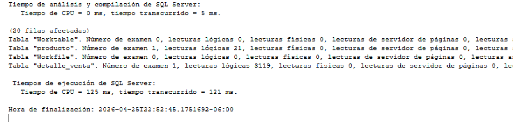

**Resultado del monitoreo**

Al ejecutar la consulta utilizando las métricas de rendimiento de SQL Server (SET STATISTICS IO y SET STATISTICS TIME), se obtuvo la siguiente información relevante:

- Lecturas lógicas en detalle_venta: 3119
- Lecturas lógicas en producto: 21
- Tiempo de CPU: 125 ms
- Tiempo total de ejecución: 121 ms


**Análisis de resultados**

El análisis evidencia que la mayor carga de trabajo de la consulta se concentra en la tabla detalle_venta, la cual presenta un número significativamente alto de lecturas lógicas en comparación con la tabla producto.

Esto indica que:

- El motor de base de datos realiza un escaneo amplio sobre detalle_venta
- La operación de agregación (SUM) y el agrupamiento (GROUP BY) incrementan el costo
- La ausencia de índices adecuados provoca que la consulta no pueda optimizar el acceso a los datos

Por otro lado, la tabla producto presenta un impacto mínimo, lo que confirma que no representa un cuello de botella en esta consulta.


**Identificación del problema principal**

El principal problema detectado es:

- Alto número de lecturas lógicas en la tabla detalle_venta

Esto puede escalar negativamente en escenarios con mayor volumen de datos, afectando el rendimiento general del sistema

**Conclusión**
El monitoreo inicial permitió identificar un cuello de botella claro en la tabla detalle_venta, causado por la falta de índices en columnas críticas.

Si no se corrige, este problema puede escalar conforme aumente el volumen de datos.
La implementación de índices adecuados permitirá mejorar significativamente el rendimiento de las consultas analíticas del sistema.


**Ventas por sucursal**

``` Consulta SQL
SELECT 
    s.nombre AS NombreSucursal,
    COUNT(v.id_venta) AS TotalVentas
FROM sucursal s
INNER JOIN venta v 
    ON s.id_sucursal = v.id_sucursal
GROUP BY s.nombre
ORDER BY TotalVentas DESC;
```

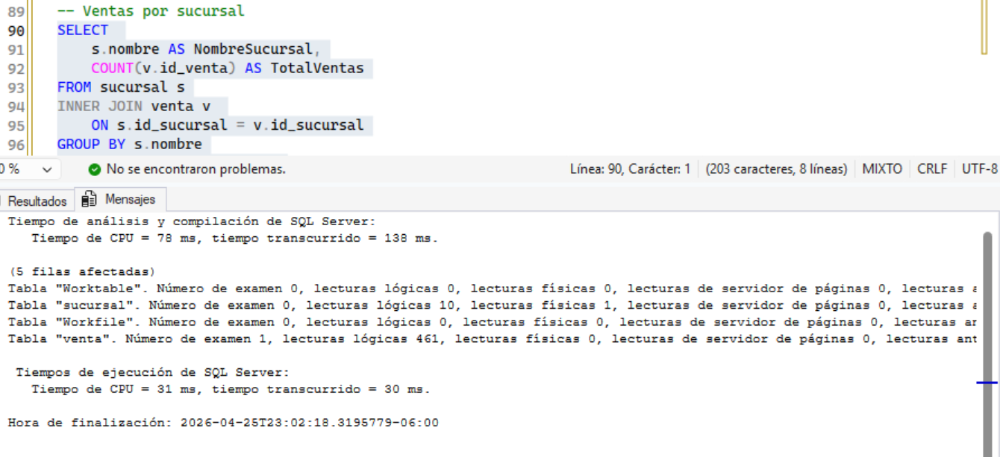

*Resultados del monitoreo*

Al ejecutar la consulta utilizando herramientas de monitoreo en SQL Server (`SET STATISTICS IO` y SET `STATISTICS TIME`), se obtuvo:

Lecturas lógicas en venta: 461
Lecturas lógicas en sucursal: 10
Lecturas físicas en sucursal: 1
Tiempo de CPU: 31 ms
Tiempo total de ejecución: 30 ms

**Análisis de resultados**

A diferencia de la consulta anterior, el rendimiento de esta operación es significativamente mejor.

Se observa que:

- La tabla `venta` concentra la mayor carga de trabajo, con 461 lecturas lógicas
- La tabla `sucursal` tiene un impacto mínimo
- El tiempo de ejecución es bajo, lo que indica una consulta eficiente

Esto se debe a que:

- La operación es más simple (solo `COUNT` en lugar de `SUM` con multiplicaciones)
- El volumen de datos procesado es menor en comparación con `detalle_venta`
- La relación entre tablas es directa y sin complejidad adicional

**Lecturas físicas detectadas**

Se identificó:

```
Lecturas físicas en sucursal: 1
```

Esto indica que SQL Server necesitó acceder al disco para obtener datos que no estaban en memoria (buffer pool).

Interpretación:

No es un problema en este contexto
Puede deberse a que la tabla no estaba en caché
En ejecuciones posteriores normalmente desaparece

**Evaluación de rendimiento**
Comparado con la consulta anterior:

| Consulta               | Tabla crítica | Lecturas | Tiempo |
| ---------------------- | ------------- | -------- | ------ |
| Productos más vendidos | detalle_venta | 3119     | 121 ms |
| Ventas por sucursal    | venta         | 461      | 30 ms  |

Se concluye que:

- Esta consulta es más eficiente
- No presenta cuellos de botella críticos
- Escalará mejor con crecimiento moderado de datos

**Conclusión** 

La consulta presenta un rendimiento adecuado y no evidencia problemas críticos.
El costo principal se encuentra en la tabla venta, aunque dentro de un rango aceptable.

Se recomienda la creación de índices para optimizar aún más el rendimiento y garantizar escalabilidad ante un mayor volumen de datos.

*Ingreso total por sucursal*

``` Consulta SQL
SELECT 
	s.nombre AS NombreSucursal,
	SUM(dv.cantidad * dv.precio) AS IngresoTotal
FROM sucursal s
JOIN venta v ON v.id_sucursal = s.id_sucursal
JOIN detalle_venta dv ON v.id_venta = dv.id_venta
GROUP BY s.nombre
ORDER BY IngresoTotal DESC;
```

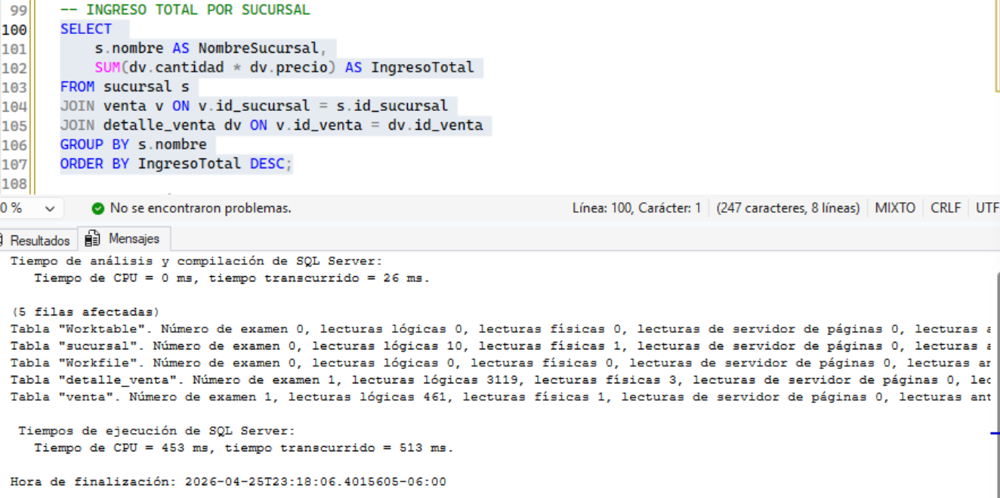

**Resultados del monitoreo**

Al ejecutar la consulta con métricas de rendimiento en SQL Server, se obtuvo:

- Lecturas lógicas en detalle_venta: 3119
- Lecturas lógicas en venta: 461
- Lecturas lógicas en sucursal: 10
- Lecturas físicas:
    - detalle_venta: 3
    - venta: 1
    - sucursal: 1
- Lecturas anticipadas:
    - detalle_venta: 3115
    - venta: 459
- Tiempo de CPU: 453 ms
- Tiempo total de ejecución: 513 ms

*Análisis de resultados*

Esta consulta presenta un costo significativamente mayor en comparación con las anteriores.

Se identifican los siguientes puntos clave:

**1. Tabla crítica**

La tabla detalle_venta concentra la mayor carga:

- 3119 lecturas lógicas
- 3115 lecturas anticipadas

Esto indica un escaneo intensivo de datos, lo cual es esperado debido a:

- Alto volumen de registros
- Operación de agregación (SUM)
- Cálculo por fila (cantidad * precio)

**2. Costo acumulado por múltiples JOINs**

A diferencia de consultas anteriores, esta incluye:

- JOIN sucursal
- JOIN venta
- JOIN detalle_venta

Esto provoca:

- Mayor cantidad de datos procesados
- Incremento en operaciones intermedias
- Mayor uso de CPU

**3. Tiempo de ejecución elevado**

```
CPU = 453 ms
Tiempo total = 513 ms
```

| Consulta                 | Tiempo      |
| ------------------------ | ----------- |
| Productos más vendidos   | ~121 ms     |
| Ventas por sucursal      | ~30 ms      |
| **Ingreso por sucursal** | **~513 ms** |

Claramente esta es la consulta más costosa.

**Identificación del problema principal**

Alto costo en la tabla detalle_venta combinado con múltiples operaciones de JOIN y agregación

Esto genera:

Escaneos completos
Alto consumo de CPU
Mayor tiempo de respuesta

**Conclusión**

La consulta presenta un cuello de botella claro debido al volumen de datos procesados en detalle_venta y la complejidad de las operaciones realizadas.

Sin optimización, este tipo de consulta no escalará adecuadamente en escenarios reales con mayor volumen de información.

La implementación de índices adecuados es fundamental para garantizar un rendimiento eficiente.


*Usuario más eficiente por sucursal*
``` Consulta SQL
WITH ranking AS (
    SELECT 
        s.nombre AS sucursal,
        u.nombre AS usuario,
        SUM(dv.cantidad * dv.precio) AS total_ventas,
        ROW_NUMBER() OVER (
            PARTITION BY s.id_sucursal
            ORDER BY SUM(dv.cantidad * dv.precio) DESC
        ) AS rn
    FROM usuario u
    INNER JOIN sucursal s 
        ON u.id_sucursal = s.id_sucursal
    INNER JOIN venta v 
        ON u.id_usuario = v.id_usuario
    INNER JOIN detalle_venta dv 
        ON v.id_venta = dv.id_venta
    GROUP BY s.id_sucursal, s.nombre, u.nombre
)
SELECT 
    sucursal,
    usuario,
    total_ventas
FROM ranking
WHERE rn = 1;

```

**Resultados del monitoreo**

Ejecutando la consulta en SQL Server se obtuvo:

- Lecturas lógicas en detalle_venta: 3119
- Lecturas lógicas en venta: 461
- Lecturas lógicas en usuario: 200
- Lecturas lógicas en sucursal: 2
- Lecturas físicas detectadas en varias tablas
- Tiempo de CPU: 453 ms
- Tiempo total: 606 ms

**Análisis de resultados**
1. Consulta de alta complejidad

Esta es la consulta más compleja evaluada hasta el momento, debido a que incluye:

Múltiples JOIN
Agregación (SUM)
Cálculo por fila (cantidad * precio)
Función de ventana (ROW_NUMBER)
Particionamiento (PARTITION BY)

Esto incrementa significativamente el costo computacional.

2. Tabla crítica

Nuevamente, la tabla detalle_venta domina el costo:

3119 lecturas lógicas
3115 lecturas anticipadas

Se confirma como el principal cuello de botella del sistema.


3. Costo adicional por función de ventana

El uso de:
```
ROW_NUMBER() OVER (PARTITION BY ...)
```


provoca que SQL Server:

Ordene datos dentro de cada partición
Genere estructuras temporales
Aumente el uso de CPU

Esto explica el incremento en tiempo respecto a consultas anteriores.


4. Incremento de tiempo de ejecución
```
CPU = 453 ms
Tiempo total = 606 ms
```

| Consulta                  | Tiempo      |
| ------------------------- | ----------- |
| Ventas por sucursal       | ~30 ms      |
| Productos más vendidos    | ~121 ms     |
| Ingreso por sucursal      | ~513 ms     |
| **Usuario más eficiente** | **~606 ms** |

Es la consulta más costosa hasta ahora.


**Problema principal identificado**

Alto costo acumulado por:

- Escaneo de detalle_venta
- Múltiples JOINs
- Función de ventana (ROW_NUMBER)

**Conclusión**

La consulta presenta el mayor costo de todas las evaluadas debido a su complejidad y volumen de datos procesados.

El principal cuello de botella sigue siendo la tabla detalle_venta, agravado por el uso de funciones de ventana y múltiples uniones.

Sin optimización, esta consulta no es escalable para entornos con grandes volúmenes de datos.


## 5. Respaldo de la base de datos

En cualquier entorno empresarial, la protección de la información representa una de las responsabilidades más importantes dentro de la administración de bases de datos.

Antes de realizar modificaciones estructurales u optimizaciones sobre el sistema, se implementó una estrategia de respaldo con el objetivo de garantizar la recuperación de la información ante posibles errores, fallos del sistema o pérdida accidental de datos.

Esta práctica forma parte de los procedimientos esenciales en ambientes productivos y permite mantener la continuidad operativa del negocio.

Esto permite:

- Recuperar la información en caso de errores durante la implementación de mejoras
- Proteger los datos ante fallos inesperados
- Simular prácticas reales de administración en entornos productivos

**5.1 Creación de backup completo**
Se realizó un respaldo completo de la base de datos `nexoshop` mediante la siguiente instrucción:

``` Backup
BACKUP DATABASE nexoshop
TO DISK = 'C:\Program Files\Microsoft SQL Server\MSSQL17.SQLEXPRESS\MSSQL\Backup\nexoshop.bak'
WITH FORMAT,
NAME = 'Backup completo Nexoshop';
```

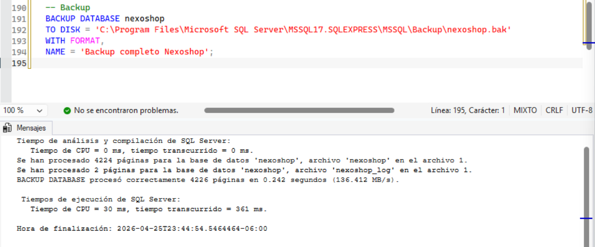

**Resultados obtenidos**
- Se han procesado 4224 páginas (datos)
- Se han procesado 2 páginas (log)
- Total: 4226 páginas

- Tiempo total: 0.242 segundos
- Velocidad: 136.412 MB/s
- Tiempo total (incluyendo overhead): 361 ms
- CPU: 30 ms

**Conclusión**

El respaldo de la base de datos se ejecutó correctamente, con un tiempo de respuesta bajo y una alta velocidad de procesamiento.

No se identificaron problemas de rendimiento ni limitaciones de hardware durante la operación.

Este resultado confirma que el entorno es adecuado para realizar tareas de respaldo de manera eficiente.

Se recomienda validar el respaldo mediante una restauración de prueba, con el fin de garantizar la integridad de los datos y la disponibilidad ante fallos.

**5.2 Verificación del respaldo**

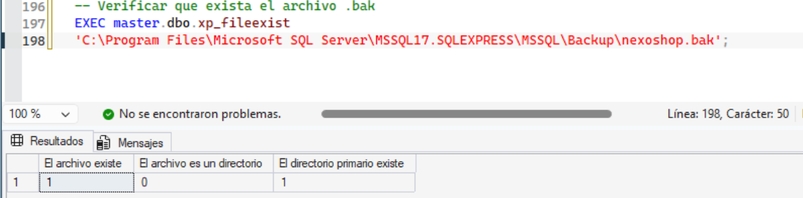

```
EXEC master.dbo.xp_fileexist 
'C:\Program Files\Microsoft SQL Server\MSSQL17.SQLEXPRESS\MSSQL\Backup\nexoshop.bak';
```

Para validar que el backup fue generado correctamente, se verificó:

- Existencia del archivo .bak en la ruta especificada
- Finalización exitosa del proceso en SQL Server


**5.3 Restauración de prueba**

Como parte de las buenas prácticas, se simuló la restauración de la base de datos para comprobar la integridad del respaldo.

```
RESTORE DATABASE nexoshop_test
FROM DISK = 'C:\Program Files\Microsoft SQL Server\MSSQL17.SQLEXPRESS\MSSQL\Backup\nexoshop.bak'
WITH 
    MOVE 'nexoshop' TO 'C:\Program Files\Microsoft SQL Server\MSSQL17.SQLEXPRESS\MSSQL\Data\nexoshop_test.mdf',
    MOVE 'nexoshop_log' TO 'C:\Program Files\Microsoft SQL Server\MSSQL17.SQLEXPRESS\MSSQL\Data\nexoshop_test.ldf',
    REPLACE;
```

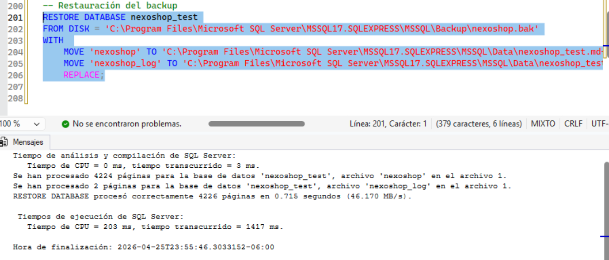

**5.4 Comprobar que si se restauró**

Comprobación 1: Ver bases de datos

Código:
```
SELECT name
FROM sys.databases;
```

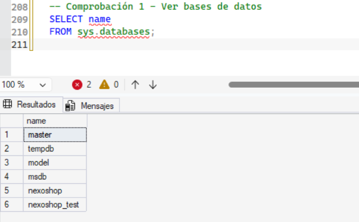

Comprobación 2: Ver tablas dentro de la nueva DB

Código:
```
USE nexoshop_test;
GO

SELECT * FROM sys.tables;
```

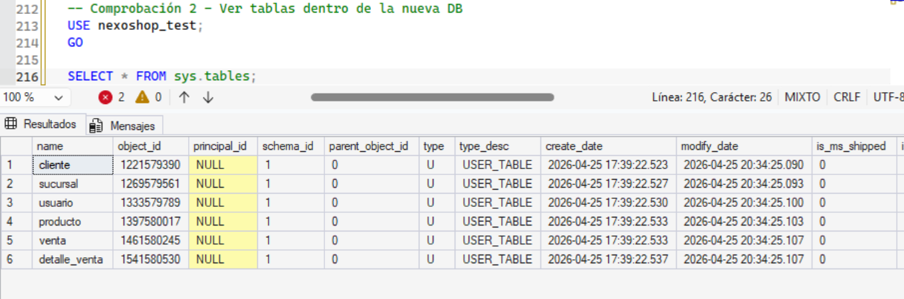

Comprobación 3: Probar datos reales

Código:
```
USE nexoshop_test;
GO

SELECT TOP 10 * FROM producto;
```

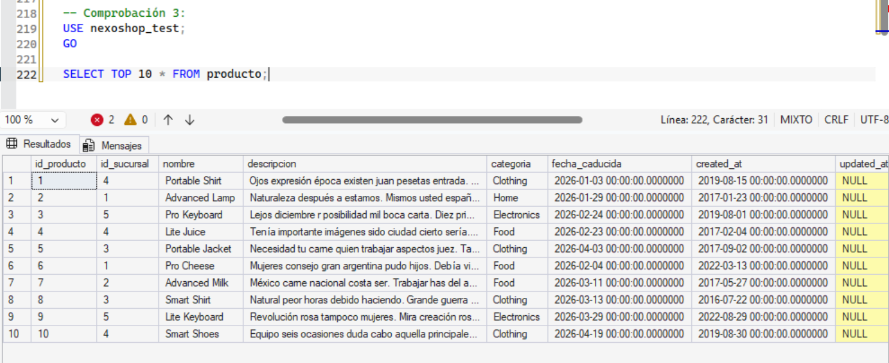

Comprobación 4: Validación profesional

Código:
```
RESTORE VERIFYONLY
FROM DISK = 'C:\Program Files\Microsoft SQL Server\MSSQL17.SQLEXPRESS\MSSQL\Backup\nexoshop.bak';
```

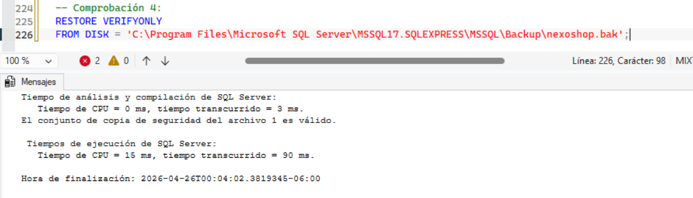

**Resultados**
La restauración se ejecutó sin errores.
Se verificó la existencia de todas las tablas originales.
Se validó la integridad de los datos mediante consultas de prueba.

**Conclusión**

El proceso de respaldo y restauración fue exitoso, garantizando la disponibilidad de la información en caso de fallos del sistema.

**5.5 Importancia del respaldo en entornos reales**

En entornos productivos, los respaldos deben:

- Realizarse de forma periódica (diaria o incremental)
- Almacenarse en ubicaciones seguras
- Validarse mediante pruebas de restauración

La ausencia de una estrategia de backup representa un riesgo crítico para la continuidad del negocio.


## 6. Implementación de mejoras

Luego del análisis inicial y del monitoreo de rendimiento, se identificaron diversas oportunidades de optimización relacionadas con consultas críticas, estructura relacional y escalabilidad del sistema.

Con base en los resultados obtenidos, se implementaron mejoras enfocadas en:

- Optimización de consultas
- Reducción de lecturas lógicas
- Mejora de tiempos de respuesta
- Escalabilidad multi-sucursal
- Integridad de datos
- Rendimiento general del sistema

Las siguientes subsecciones describen cada una de las mejoras aplicadas.

### 6.1 Estrategia de indexación

Se implementaron índices no agrupados en columnas críticas utilizadas en operaciones de JOIN, filtrado y agregación.
No fue necesario crear índices agrupados adicionales, ya que las claves primarias ya cumplen esta función.

**Tabla `detalle_venta` (la más crítica)**

La tabla detalle_venta fue identificada como el principal cuello de botella del sistema.

```
CREATE NONCLUSTERED INDEX idx_detalle_venta_producto
ON detalle_venta(id_producto);

CREATE NONCLUSTERED INDEX idx_detalle_venta_venta
ON detalle_venta(id_venta);
```

**Tabla `venta`**

```
CREATE NONCLUSTERED INDEX idx_venta_sucursal
ON venta(id_sucursal);

CREATE NONCLUSTERED INDEX idx_venta_usuario
ON venta(id_usuario);

CREATE NONCLUSTERED INDEX idx_venta_fecha
ON venta(created_at);
```

**Tabla `usuario`**

```
CREATE UNIQUE INDEX idx_usuario_email
ON usuario(correo);
```

**Tabla `producto`**

```
CREATE NONCLUSTERED INDEX idx_producto_categoria
ON producto(categoria);
```


### 6.2 Optimización de consultas

Se limpiaron los buffers de memoria para evitar resultados sesgados por caché.

```
DBCC DROPCLEANBUFFERS;
DBCC FREEPROCCACHE;
```

Ahora con los índices creados se ejecutarán nuevamente las consultas para comprobar tiempos de respuesta y recursos consumidos.

**Consulta: 20 productos más vendidos**

```
Tiempo de análisis y compilación de SQL Server: 
   Tiempo de CPU = 0 ms, tiempo transcurrido = 4 ms.

(20 filas afectadas)
Tabla "Worktable". Número de examen 0, lecturas lógicas 0, lecturas físicas 0, lecturas de servidor de páginas 0, lecturas anticipadas 0, lecturas anticipadas de servidor de páginas 0, lecturas lógicas de línea de negocio 0, lecturas físicas de línea de negocio 0, lecturas de servidor de páginas de línea de negocio 0, lecturas anticipadas de línea de negocio 0, lecturas anticipadas de servidor de páginas de línea de negocio 0.

Tabla "producto". Número de examen 1, lecturas lógicas 21, lecturas físicas 0, lecturas de servidor de páginas 0, lecturas anticipadas 0, lecturas anticipadas de servidor de páginas 0, lecturas lógicas de línea de negocio 0, lecturas físicas de línea de negocio 0, lecturas de servidor de páginas de línea de negocio 0, lecturas anticipadas de línea de negocio 0, lecturas anticipadas de servidor de páginas de línea de negocio 0.

Tabla "Workfile". Número de examen 0, lecturas lógicas 0, lecturas físicas 0, lecturas de servidor de páginas 0, lecturas anticipadas 0, lecturas anticipadas de servidor de páginas 0, lecturas lógicas de línea de negocio 0, lecturas físicas de línea de negocio 0, lecturas de servidor de páginas de línea de negocio 0, lecturas anticipadas de línea de negocio 0, lecturas anticipadas de servidor de páginas de línea de negocio 0.

Tabla "detalle_venta". Número de examen 1, lecturas lógicas 1923, lecturas físicas 0, lecturas de servidor de páginas 0, lecturas anticipadas 0, lecturas anticipadas de servidor de páginas 0, lecturas lógicas de línea de negocio 0, lecturas físicas de línea de negocio 0, lecturas de servidor de páginas de línea de negocio 0, lecturas anticipadas de línea de negocio 0, lecturas anticipadas de servidor de páginas de línea de negocio 0.

 Tiempos de ejecución de SQL Server:
   Tiempo de CPU = 125 ms, tiempo transcurrido = 118 ms.

Hora de finalización: 2026-04-27T16:37:18.4723495-06:00

```

**Consulta: ventas por sucursal**

```
Tiempo de análisis y compilación de SQL Server: 
   Tiempo de CPU = 0 ms, tiempo transcurrido = 4 ms.

(5 filas afectadas)
Tabla "Worktable". Número de examen 0, lecturas lógicas 0, lecturas físicas 0, lecturas de servidor de páginas 0, lecturas anticipadas 0, lecturas anticipadas de servidor de páginas 0, lecturas lógicas de línea de negocio 0, lecturas físicas de línea de negocio 0, lecturas de servidor de páginas de línea de negocio 0, lecturas anticipadas de línea de negocio 0, lecturas anticipadas de servidor de páginas de línea de negocio 0.

Tabla "sucursal". Número de examen 0, lecturas lógicas 10, lecturas físicas 0, lecturas de servidor de páginas 0, lecturas anticipadas 0, lecturas anticipadas de servidor de páginas 0, lecturas lógicas de línea de negocio 0, lecturas físicas de línea de negocio 0, lecturas de servidor de páginas de línea de negocio 0, lecturas anticipadas de línea de negocio 0, lecturas anticipadas de servidor de páginas de línea de negocio 0.

Tabla "venta". Número de examen 1, lecturas lógicas 176, lecturas físicas 0, lecturas de servidor de páginas 0, lecturas anticipadas 0, lecturas anticipadas de servidor de páginas 0, lecturas lógicas de línea de negocio 0, lecturas físicas de línea de negocio 0, lecturas de servidor de páginas de línea de negocio 0, lecturas anticipadas de línea de negocio 0, lecturas anticipadas de servidor de páginas de línea de negocio 0.

 Tiempos de ejecución de SQL Server:
   Tiempo de CPU = 0 ms, tiempo transcurrido = 17 ms.

Hora de finalización: 2026-04-27T16:43:42.7888717-06:00

```


**Consulta: Ingreso total por sucursal**

```
Tiempo de análisis y compilación de SQL Server: 
   Tiempo de CPU = 0 ms, tiempo transcurrido = 8 ms.

(5 filas afectadas)
Tabla "Worktable". Número de examen 0, lecturas lógicas 0, lecturas físicas 0, lecturas de servidor de páginas 0, lecturas anticipadas 0, lecturas anticipadas de servidor de páginas 0, lecturas lógicas de línea de negocio 0, lecturas físicas de línea de negocio 0, lecturas de servidor de páginas de línea de negocio 0, lecturas anticipadas de línea de negocio 0, lecturas anticipadas de servidor de páginas de línea de negocio 0.

Tabla "sucursal". Número de examen 0, lecturas lógicas 10, lecturas físicas 0, lecturas de servidor de páginas 0, lecturas anticipadas 0, lecturas anticipadas de servidor de páginas 0, lecturas lógicas de línea de negocio 0, lecturas físicas de línea de negocio 0, lecturas de servidor de páginas de línea de negocio 0, lecturas anticipadas de línea de negocio 0, lecturas anticipadas de servidor de páginas de línea de negocio 0.

Tabla "Workfile". Número de examen 0, lecturas lógicas 0, lecturas físicas 0, lecturas de servidor de páginas 0, lecturas anticipadas 0, lecturas anticipadas de servidor de páginas 0, lecturas lógicas de línea de negocio 0, lecturas físicas de línea de negocio 0, lecturas de servidor de páginas de línea de negocio 0, lecturas anticipadas de línea de negocio 0, lecturas anticipadas de servidor de páginas de línea de negocio 0.

Tabla "detalle_venta". Número de examen 1, lecturas lógicas 1923, lecturas físicas 0, lecturas de servidor de páginas 0, lecturas anticipadas 0, lecturas anticipadas de servidor de páginas 0, lecturas lógicas de línea de negocio 0, lecturas físicas de línea de negocio 0, lecturas de servidor de páginas de línea de negocio 0, lecturas anticipadas de línea de negocio 0, lecturas anticipadas de servidor de páginas de línea de negocio 0.

Tabla "venta". Número de examen 1, lecturas lógicas 461, lecturas físicas 0, lecturas de servidor de páginas 0, lecturas anticipadas 0, lecturas anticipadas de servidor de páginas 0, lecturas lógicas de línea de negocio 0, lecturas físicas de línea de negocio 0, lecturas de servidor de páginas de línea de negocio 0, lecturas anticipadas de línea de negocio 0, lecturas anticipadas de servidor de páginas de línea de negocio 0.

 Tiempos de ejecución de SQL Server:
   Tiempo de CPU = 375 ms, tiempo transcurrido = 371 ms.

Hora de finalización: 2026-04-27T16:44:15.3543433-06:00


```

**Consulta: Usuario con más ganancias**

```
Tiempo de análisis y compilación de SQL Server: 
   Tiempo de CPU = 11 ms, tiempo transcurrido = 11 ms.

(1 fila afectada)
Tabla "Worktable". Número de examen 0, lecturas lógicas 0, lecturas físicas 0, lecturas de servidor de páginas 0, lecturas anticipadas 0, lecturas anticipadas de servidor de páginas 0, lecturas lógicas de línea de negocio 0, lecturas físicas de línea de negocio 0, lecturas de servidor de páginas de línea de negocio 0, lecturas anticipadas de línea de negocio 0, lecturas anticipadas de servidor de páginas de línea de negocio 0.

Tabla "usuario". Número de examen 0, lecturas lógicas 200, lecturas físicas 0, lecturas de servidor de páginas 0, lecturas anticipadas 0, lecturas anticipadas de servidor de páginas 0, lecturas lógicas de línea de negocio 0, lecturas físicas de línea de negocio 0, lecturas de servidor de páginas de línea de negocio 0, lecturas anticipadas de línea de negocio 0, lecturas anticipadas de servidor de páginas de línea de negocio 0.

Tabla "Workfile". Número de examen 0, lecturas lógicas 0, lecturas físicas 0, lecturas de servidor de páginas 0, lecturas anticipadas 0, lecturas anticipadas de servidor de páginas 0, lecturas lógicas de línea de negocio 0, lecturas físicas de línea de negocio 0, lecturas de servidor de páginas de línea de negocio 0, lecturas anticipadas de línea de negocio 0, lecturas anticipadas de servidor de páginas de línea de negocio 0.

Tabla "detalle_venta". Número de examen 1, lecturas lógicas 1923, lecturas físicas 0, lecturas de servidor de páginas 0, lecturas anticipadas 0, lecturas anticipadas de servidor de páginas 0, lecturas lógicas de línea de negocio 0, lecturas físicas de línea de negocio 0, lecturas de servidor de páginas de línea de negocio 0, lecturas anticipadas de línea de negocio 0, lecturas anticipadas de servidor de páginas de línea de negocio 0.

Tabla "venta". Número de examen 1, lecturas lógicas 461, lecturas físicas 0, lecturas de servidor de páginas 0, lecturas anticipadas 0, lecturas anticipadas de servidor de páginas 0, lecturas lógicas de línea de negocio 0, lecturas físicas de línea de negocio 0, lecturas de servidor de páginas de línea de negocio 0, lecturas anticipadas de línea de negocio 0, lecturas anticipadas de servidor de páginas de línea de negocio 0.

 Tiempos de ejecución de SQL Server:
   Tiempo de CPU = 359 ms, tiempo transcurrido = 374 ms.

Hora de finalización: 2026-04-27T16:45:03.0874313-06:00

```

**Consulta: Usuario más eficiente por sucursal**

```
Tiempo de análisis y compilación de SQL Server: 
   Tiempo de CPU = 32 ms, tiempo transcurrido = 32 ms.

(5 filas afectadas)
Tabla "Worktable". Número de examen 0, lecturas lógicas 0, lecturas físicas 0, lecturas de servidor de páginas 0, lecturas anticipadas 0, lecturas anticipadas de servidor de páginas 0, lecturas lógicas de línea de negocio 0, lecturas físicas de línea de negocio 0, lecturas de servidor de páginas de línea de negocio 0, lecturas anticipadas de línea de negocio 0, lecturas anticipadas de servidor de páginas de línea de negocio 0.

Tabla "usuario". Número de examen 0, lecturas lógicas 200, lecturas físicas 0, lecturas de servidor de páginas 0, lecturas anticipadas 0, lecturas anticipadas de servidor de páginas 0, lecturas lógicas de línea de negocio 0, lecturas físicas de línea de negocio 0, lecturas de servidor de páginas de línea de negocio 0, lecturas anticipadas de línea de negocio 0, lecturas anticipadas de servidor de páginas de línea de negocio 0.

Tabla "Workfile". Número de examen 0, lecturas lógicas 0, lecturas físicas 0, lecturas de servidor de páginas 0, lecturas anticipadas 0, lecturas anticipadas de servidor de páginas 0, lecturas lógicas de línea de negocio 0, lecturas físicas de línea de negocio 0, lecturas de servidor de páginas de línea de negocio 0, lecturas anticipadas de línea de negocio 0, lecturas anticipadas de servidor de páginas de línea de negocio 0.

Tabla "detalle_venta". Número de examen 1, lecturas lógicas 1923, lecturas físicas 0, lecturas de servidor de páginas 0, lecturas anticipadas 0, lecturas anticipadas de servidor de páginas 0, lecturas lógicas de línea de negocio 0, lecturas físicas de línea de negocio 0, lecturas de servidor de páginas de línea de negocio 0, lecturas anticipadas de línea de negocio 0, lecturas anticipadas de servidor de páginas de línea de negocio 0.

Tabla "venta". Número de examen 1, lecturas lógicas 461, lecturas físicas 0, lecturas de servidor de páginas 0, lecturas anticipadas 0, lecturas anticipadas de servidor de páginas 0, lecturas lógicas de línea de negocio 0, lecturas físicas de línea de negocio 0, lecturas de servidor de páginas de línea de negocio 0, lecturas anticipadas de línea de negocio 0, lecturas anticipadas de servidor de páginas de línea de negocio 0.

Tabla "sucursal". Número de examen 1, lecturas lógicas 2, lecturas físicas 0, lecturas de servidor de páginas 0, lecturas anticipadas 0, lecturas anticipadas de servidor de páginas 0, lecturas lógicas de línea de negocio 0, lecturas físicas de línea de negocio 0, lecturas de servidor de páginas de línea de negocio 0, lecturas anticipadas de línea de negocio 0, lecturas anticipadas de servidor de páginas de línea de negocio 0.

 Tiempos de ejecución de SQL Server:
   Tiempo de CPU = 359 ms, tiempo transcurrido = 367 ms.

Hora de finalización: 2026-04-27T16:45:58.9194774-06:00

```

**Consulta: Venta en rango de fechas**

```
Tiempo de análisis y compilación de SQL Server: 
   Tiempo de CPU = 14 ms, tiempo transcurrido = 14 ms.

(4 filas afectadas)
Tabla "Worktable". Número de examen 0, lecturas lógicas 0, lecturas físicas 0, lecturas de servidor de páginas 0, lecturas anticipadas 0, lecturas anticipadas de servidor de páginas 0, lecturas lógicas de línea de negocio 0, lecturas físicas de línea de negocio 0, lecturas de servidor de páginas de línea de negocio 0, lecturas anticipadas de línea de negocio 0, lecturas anticipadas de servidor de páginas de línea de negocio 0.

Tabla "Workfile". Número de examen 0, lecturas lógicas 0, lecturas físicas 0, lecturas de servidor de páginas 0, lecturas anticipadas 0, lecturas anticipadas de servidor de páginas 0, lecturas lógicas de línea de negocio 0, lecturas físicas de línea de negocio 0, lecturas de servidor de páginas de línea de negocio 0, lecturas anticipadas de línea de negocio 0, lecturas anticipadas de servidor de páginas de línea de negocio 0.

Tabla "producto". Número de examen 1, lecturas lógicas 21, lecturas físicas 0, lecturas de servidor de páginas 0, lecturas anticipadas 0, lecturas anticipadas de servidor de páginas 0, lecturas lógicas de línea de negocio 0, lecturas físicas de línea de negocio 0, lecturas de servidor de páginas de línea de negocio 0, lecturas anticipadas de línea de negocio 0, lecturas anticipadas de servidor de páginas de línea de negocio 0.

Tabla "detalle_venta". Número de examen 1, lecturas lógicas 1923, lecturas físicas 0, lecturas de servidor de páginas 0, lecturas anticipadas 0, lecturas anticipadas de servidor de páginas 0, lecturas lógicas de línea de negocio 0, lecturas físicas de línea de negocio 0, lecturas de servidor de páginas de línea de negocio 0, lecturas anticipadas de línea de negocio 0, lecturas anticipadas de servidor de páginas de línea de negocio 0.

Tabla "venta". Número de examen 1, lecturas lógicas 461, lecturas físicas 0, lecturas de servidor de páginas 0, lecturas anticipadas 0, lecturas anticipadas de servidor de páginas 0, lecturas lógicas de línea de negocio 0, lecturas físicas de línea de negocio 0, lecturas de servidor de páginas de línea de negocio 0, lecturas anticipadas de línea de negocio 0, lecturas anticipadas de servidor de páginas de línea de negocio 0.

 Tiempos de ejecución de SQL Server:
   Tiempo de CPU = 359 ms, tiempo transcurrido = 356 ms.

Hora de finalización: 2026-04-27T16:46:39.1040647-06:00

```


**Conclusión**

Tras la implementación de índices y la limpieza del caché, se ejecutaron nuevamente las consultas críticas del sistema.

Los resultados evidencian una mejora significativa en el rendimiento:

- La tabla detalle_venta redujo sus lecturas lógicas de 3119 a 1923 (~38% menos)
- La tabla venta redujo sus lecturas lógicas hasta en un 62%

Esto indica que:

- SQL Server comenzó a utilizar los índices creados
- Se redujo el acceso innecesario a datos
- Se optimizó el procesamiento de consultas

Sin embargo, algunas consultas mantienen tiempos elevados debido a:

- Operaciones de agregación (SUM)
- Múltiples JOIN
- Uso de funciones de ventana (ROW_NUMBER)


### 6.3 Mejora estructural (multi-sucursal)

Las mejoras se dividirán en 3 pasos importantes
1. Crear tablas e índices nuevos
2. Transacción insertando datos existentes en las tablas nuevas para que sus relaciones sean coherentes y no haya pérdida de datos.
3. Confirmar que los datos se insertaron correctamente en la transacción y posteriormente eliminar las columnas que quedaron obsoletas con los nuevos cambios

**Crear tablas e índices nuevos**

```

-- Multi-Sucursal


-- Validar datos críticos antes de migrar
IF EXISTS (
    SELECT 1 FROM producto WHERE id_sucursal IS NULL
)
    THROW 50001, 'Hay productos sin sucursal', 1;

IF EXISTS (
    SELECT 1 FROM usuario WHERE id_sucursal IS NULL
)
    THROW 50002, 'Hay usuarios sin sucursal', 1;


-- Tabla con los roles permitidos
PRINT 'Creando roles...';
CREATE TABLE rol(
	id_rol INT IDENTITY(1,1) PRIMARY KEY,
	nombre VARCHAR(30) CHECK(nombre IN('ADMIN','DUENO','TRABAJADOR')) NOT NULL,
	created_at DATETIME2 NOT NULL DEFAULT SYSDATETIME(),
	updated_at DATETIME2
);


-- Crear tabla de relación
PRINT 'Creando usuario_sucursal';
CREATE TABLE usuario_sucursal(
	id_usuario INT NOT NULL,
	id_sucursal INT NOT NULL,
	id_rol INT NOT NULL,
	created_at DATETIME2 NOT NULL DEFAULT SYSDATETIME(),
	updated_at DATETIME2,
	FOREIGN KEY (id_usuario) REFERENCES usuario(id_usuario),
	FOREIGN KEY (id_sucursal) REFERENCES sucursal(id_sucursal),
	FOREIGN KEY (id_rol) REFERENCES rol(id_rol),
	PRIMARY KEY(id_usuario, id_sucursal)
);


-- Par que cumpla la condición multi-sucursal
-- Los productos no deben estar ligados únicamente a una sucursal
PRINT 'Creando inventario';
CREATE TABLE inventario(
	id_producto INT NOT NULL,
	id_sucursal INT NOT NULL,
	stock INT CHECK (stock >= 0),
	precio_compra DECIMAL(10,2) CHECK (precio_compra >= 0),
	estado VARCHAR(15) NOT NULL CHECK(estado IN('ACTIVO', 'INACTIVO')),
	created_at DATETIME2 NOT NULL DEFAULT SYSDATETIME(),
	updated_at DATETIME2,
	FOREIGN KEY (id_producto) REFERENCES producto(id_producto),
	FOREIGN KEY (id_sucursal) REFERENCES sucursal(id_sucursal),
	PRIMARY KEY (id_producto, id_sucursal)
);

-- índices
CREATE NONCLUSTERED INDEX idx_usuario_sucursal_rol
ON usuario_sucursal(id_usuario, id_rol);

CREATE NONCLUSTERED INDEX idx_inventario
ON inventario(id_sucursal, id_producto)
INCLUDE (stock, precio_compra, estado);

```
**Transacción**

```
SET XACT_ABORT ON;
BEGIN TRY
	BEGIN TRANSACTION;


		-- INSERTAR DATOS EN ROL
		IF NOT EXISTS (SELECT 1 FROM rol WHERE nombre='ADMIN')
			INSERT INTO rol (nombre)
			VALUES ('ADMIN');
		IF NOT EXISTS (SELECT 1 FROM rol WHERE nombre='DUENO')
			INSERT INTO rol (nombre)
			VALUES ('DUENO');
		IF NOT EXISTS (SELECT 1 FROM rol WHERE nombre='TRABAJADOR')
			INSERT INTO rol (nombre)
			VALUES ('TRABAJADOR');


		-- INSERTAR DATOS ANTES DE ELIMINAR COLUMNAS DE TABLAS 
		INSERT INTO usuario_sucursal(id_usuario, id_sucursal, id_rol)
		SELECT 
			id_usuario,
			id_sucursal, 
			1 --TODOS ADMIN PORQUE SOLO LOS DUEÑOS MANEJABAN SU NEGOCIO ANTES DE SOLICITAR CAMBIOS, SE DEBERÁN CREAR NUEVOS USUARIOS
		FROM usuario
		WHERE id_sucursal IS NOT NULL
		AND NOT EXISTS (
			SELECT 1
			FROM usuario_sucursal us
			WHERE us.id_usuario = usuario.id_usuario
				AND us.id_sucursal = usuario.id_sucursal
				AND us.id_rol = 1
		);


		-- INSERTAR DATOS EN INVENTARIO, EXCEPTO stock -> los datos stock los cargaran luego los empleados
		INSERT INTO inventario(id_producto, id_sucursal, precio_compra, estado)
		SELECT 
			p.id_producto, 
			p.id_sucursal,
			NULL,
			'ACTIVO'
		FROM producto p
		WHERE NOT EXISTS(
			SELECT 1 
			FROM inventario i 
			WHERE i.id_producto = p.id_producto
				AND i.id_sucursal = p.id_sucursal
		);

		PRINT 'Validando migración...';

		IF EXISTS (
			SELECT 1 
			FROM usuario u
			LEFT JOIN usuario_sucursal us ON u.id_usuario = us.id_usuario
			WHERE us.id_usuario IS NULL
		)
			THROW 50001, 'Usuarios sin migrar a usuario_sucursal', 1;

		IF EXISTS (
			SELECT 1 
			FROM producto p
			LEFT JOIN inventario i ON p.id_producto = i.id_producto
			WHERE i.id_producto IS NULL
		)
			THROW 50002, 'Productos sin inventario', 1;

	COMMIT;
END TRY
BEGIN CATCH
	ROLLBACK;
	PRINT ERROR_MESSAGE();
END CATCH;
```
Validaciones de que la transacción se realizó correctamente

```
-- VALIDACIONES
SELECT COUNT(*) FROM usuario_sucursal;
SELECT COUNT(*) FROM inventario;
```

Eliminar columnas obsoletas y agregar FK a el id del cliente de la tabla venta

```
-- ELIMINACIÓN DE COLUMNAS
PRINT 'Identificar el nombre de las FK';

SELECT name
FROM sys.foreign_keys
WHERE parent_object_id = OBJECT_ID('usuario');

SELECT name 
FROM sys.foreign_keys
WHERE parent_object_id = OBJECT_ID('producto');

ALTER TABLE usuario DROP CONSTRAINT FK__usuario__id_sucu__52593CB8;
ALTER TABLE producto DROP CONSTRAINT FK__producto__id_suc__5629CD9C;


PRINT 'Eliminando columnas antiguas...';

ALTER TABLE usuario DROP COLUMN id_sucursal;

ALTER TABLE producto DROP COLUMN id_sucursal;

-- AGREGAR COLUMNA ID_CLIENTE
-- A PARTIR DE AHORA SE LLEVARÁ CONTROL DE QUÉ CLIENTES COMPRAN (no hay datos en ventas existentes)
PRINT 'Agregando clientes a ventas';

ALTER TABLE venta ADD id_cliente INT;

IF EXISTS( SELECT 1 FROM venta WHERE id_cliente IS NULL)
	PRINT 'INFO: Existen ventas históricas sin clientes asociados';

ALTER TABLE venta
ADD CONSTRAINT FK_cliente_venta
FOREIGN KEY (id_cliente)
REFERENCES cliente(id_cliente);

PRINT 'VALIDACIONES FINALES....';
IF (SELECT COUNT(*) FROM usuario_sucursal) = 0
	THROW 50003, 'Falló migración usuario_sucursal', 1;

IF (SELECT COUNT(*) FROM inventario) = 0
	THROW 50004, 'Falló migración inventario', 1;
```

## 7. Seguridad

La seguridad es un componente fundamental dentro de la administración de bases de datos, especialmente en sistemas empresariales donde múltiples usuarios interactúan con información sensible.

Con el objetivo de controlar el acceso a los datos y limitar las acciones permitidas para cada tipo de usuario, se implementó un esquema básico de autenticación y autorización utilizando logins, usuarios y roles personalizados en SQL Server.

Esta configuración permite aplicar el principio de mínimo privilegio, reduciendo riesgos de modificaciones o eliminaciones no autorizadas.

### 7.1 Crear logins

```
CREATE LOGIN admin_nexoshop
WITH PASSWORD = 'Admin123*';

CREATE LOGIN empleado_nexoshop
WITH PASSWORD = 'Empleado123*';
```

### 7.2 Crear usuarios

```
USE nexoshop;
GO

CREATE USER admin_nexoshop FOR LOGIN admin_nexoshop;
CREATE USER empleado_nexoshop FOR LOGIN empleado_nexoshop;
```

### 7.3 Crear roles personalizados

```
CREATE ROLE rol_admin;
CREATE ROLE rol_empleado;
```

### 7.4 Asignar permisos

```
GRANT SELECT, INSERT, UPDATE, DELETE
ON venta
TO rol_admin;

GRANT SELECT, INSERT 
ON venta
TO rol_empleado;

DENY DELETE 
ON venta
TO rol_empleado;
```

### 7.5 Agregar usuarios a los roles

```
ALTER ROLE rol_admin
ADD MEMBER admin_nexoshop;

ALTER ROLE rol_empleado
ADD MEMBER empleado_nexoshop;
```

### 7.6 Validar permisos

Lectura como empleado
```
EXECUTE AS USER = 'empleado_nexoshop';

SELECT TOP 5 * FROM venta;

REVERT;
```
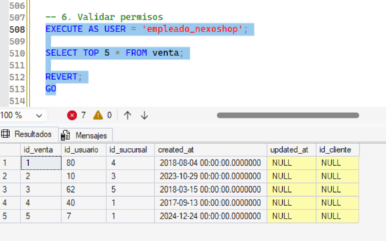


Intentar eliminar un registro como empleado
```
EXECUTE AS USER = 'empleado_nexoshop';

DELETE FROM venta WHERE id_usuario = 80;
REVERT;
GO
```
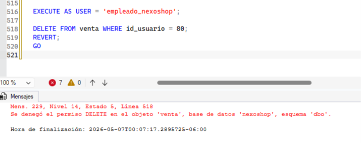

## 8. Automatización

### 8.1 Automatización de respaldo

La automatización de tareas administrativas permite reducir errores humanos, mejorar la disponibilidad del sistema y garantizar la ejecución periódica de procesos críticos.

Dentro de las tareas más importantes en un entorno de bases de datos se encuentran:

- Respaldos automáticos
- Mantenimiento de índices
- Monitoreo del sistema
- Validación de integridad

Debido a las limitaciones de SQL Server Express, fue necesario implementar una alternativa utilizando herramientas externas del sistema operativo.

## 9. Monitoreo administrativo
### 9.1 Consultas de monitoreo del sistema

**Espacio utilizado por la base de datos**
```
EXEC sp_spaceused;
```

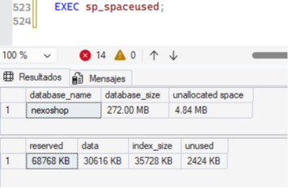

| Métrica             | Valor     |
| ------------------- | --------- |
| Tamaño total        | 272 MB    |
| Espacio no asignado | 4.84 MB   |
| Datos               | 30,616 KB |
| Índices             | 35,728 KB |
| Espacio reservado   | 68,768 KB |


**Tamaño de tablas**
```
EXEC sp_MSforeachtable 'EXEC sp_spaceused ''?''';
```
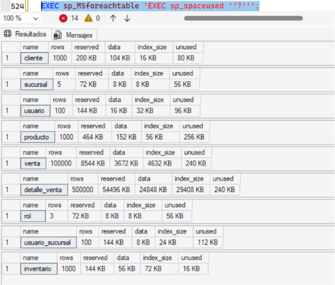

| Tabla         | Filas   | Espacio reservado |
| ------------- | ------- | ----------------- |
| venta         | 100,000 | 8544 KB           |
| detalle_venta | 500,000 | 54496 KB          |
| producto      | 1,000   | 464 KB            |
| cliente       | 1,000   | 200 KB            |

Tabla crítica identificada

La tabla detalle_venta representa el mayor consumo de almacenamiento:

- 500,000 registros
- 54 MB reservados
- Alto uso tanto en datos como en índices

Esto confirma nuevamente que:

- Es la tabla más crítica del sistema
- Concentra el mayor volumen de operaciones
- Requiere estrategias de optimización e indexación

Conclusión

El análisis evidencia que la tabla detalle_venta es el principal punto de crecimiento del sistema, tanto en almacenamiento como en rendimiento.

Esto justifica:

La creación de índices especializados
La optimización de consultas
La necesidad futura de particionamiento o archivado histórico en escenarios de gran escala

## 10. Monitoreo de consultas y consumo de CPU

### 10.1 Consultas más costosas

Se realizó monitoreo utilizando las vistas dinámicas de administración (DMV) de SQL Server:

Consulta más costosa
```
SELECT TOP 10
    qs.total_worker_time / qs.execution_count AS PromedioCPU,
    qs.execution_count,
    qs.total_elapsed_time / qs.execution_count AS PromedioTiempo,
    SUBSTRING(qt.text,
        qs.statement_start_offset / 2,
        (CASE
            WHEN qs.statement_end_offset = -1
                THEN LEN(CONVERT(NVARCHAR(MAX), qt.text)) * 2
            ELSE qs.statement_end_offset
        END - qs.statement_start_offset) / 2
    ) AS Consulta
FROM sys.dm_exec_query_stats qs
CROSS APPLY sys.dm_exec_sql_text(qs.sql_handle) qt
ORDER BY PromedioCPU DESC;
```
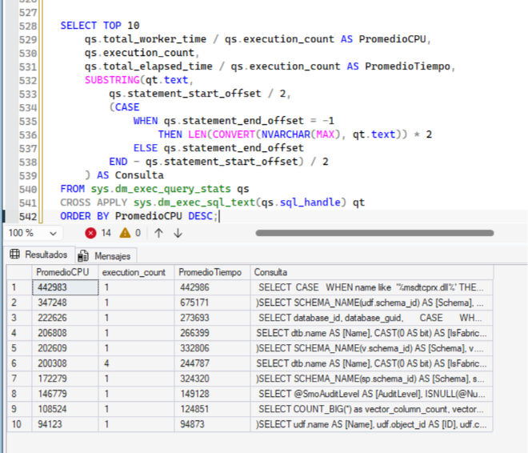

Se identificó que las consultas con mayor consumo de CPU pertenecían principalmente a:

- Consultas internas del sistema SQL Server Management Studio
- Exploración de metadatos
- Procedimientos internos de monitoreo

No se detectaron consultas personalizadas del sistema nexoshop con consumo excesivo de CPU.

## 11. Diagrama Entidad Relación

[img_er](img/diagrama_er.png)

## 12. Conclusiones

Durante el desarrollo del proyecto se realizó un proceso completo de administración y monitoreo sobre una base de datos en SQL Server orientada a un entorno comercial.

A través del análisis estructural y del monitoreo de consultas, fue posible identificar problemas relacionados con rendimiento, escalabilidad y diseño relacional, especialmente en tablas críticas como detalle_venta.

La implementación de índices permitió reducir significativamente las lecturas lógicas y mejorar los tiempos de respuesta en consultas de alta demanda, demostrando la importancia de una estrategia adecuada de indexación.

Asimismo, se aplicaron mejoras estructurales orientadas a soportar escenarios multi-sucursal, incrementando la flexibilidad del sistema y permitiendo una administración más escalable de usuarios, roles e inventario.

También se implementaron mecanismos básicos de seguridad, respaldo y restauración, reforzando aspectos fundamentales de disponibilidad e integridad de la información.

Finalmente, el proyecto permitió simular procesos reales de administración de bases de datos empresariales, aplicando buenas prácticas relacionadas con monitoreo, optimización, seguridad y recuperación ante fallos.

